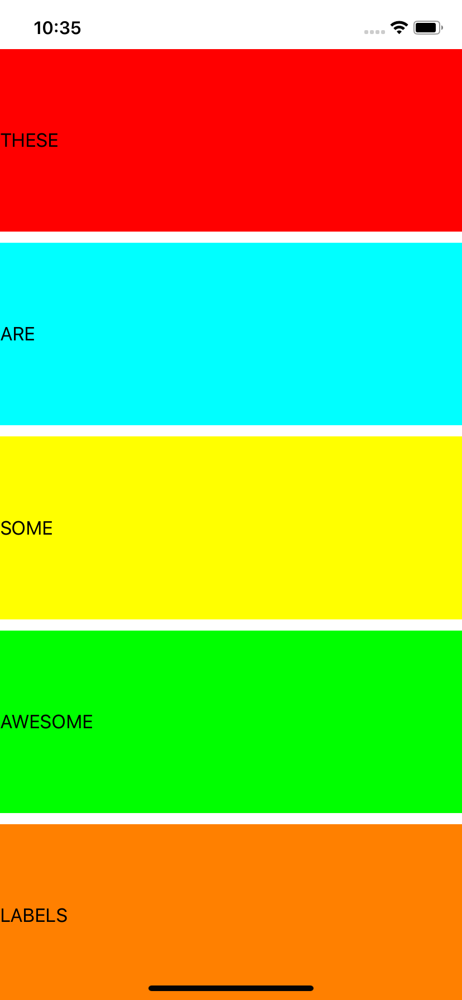

# Auto Layout

  

 
An application showing auto layout constraints defined in code.

## Examples within this code
- Equal Height, Aspect Ratio Constraints
- Visual Formatting Language
- Anchors

## Screenshots
Screenshot of labels within the application that have been sized programmatically via constraints.
 

